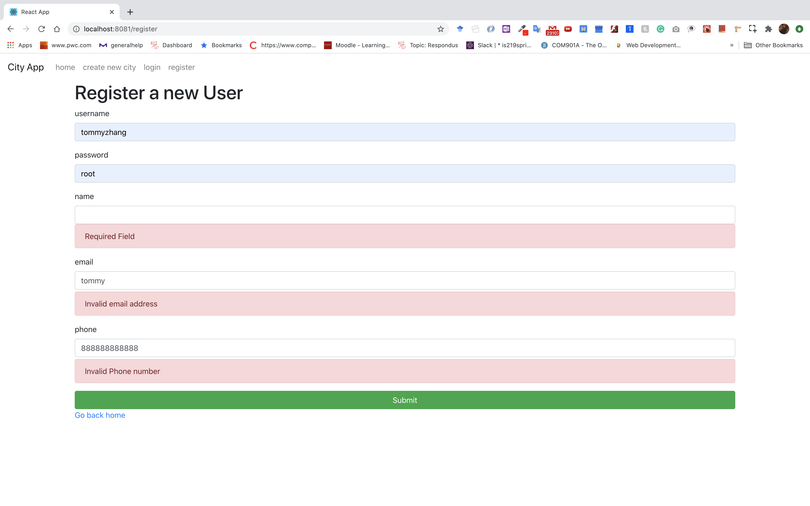

# Full Stack Flask App

## Overview
This project implements a full stack REST-based web Application with Docker, Flask, React, Redux, Mysql, and Nginx.
## Get Started
```
docker-compose up --build
```
and go to http://localhost:8081/
## Screenshots

### Index Page


### Create City Page


### Register


### Login


# Api 
## POST

## GET

## DELETED

## PUT


## Project Detail 
The project use Nginx as reverse proxy server, which connects the api server on localhost:5000 and client server on localhost:3000. By simply visiting the localhost:8081, you can access the front end and by visting localhost:8081/api/, you can access the back-end part of application
The project use Flask-SQLAlchemy as ORM model to connect with MySQL database.For the detail documentation, you can visit 
[flask-sqlalchemy](https://flask-sqlalchemy.palletsprojects.com/en/2.x/quickstart/#a-minimal-application). The application uses JWT to authenicate user.
For the front end side of project, project uses React.js and Redux for state management. In addition, application also add some form validation.
 
